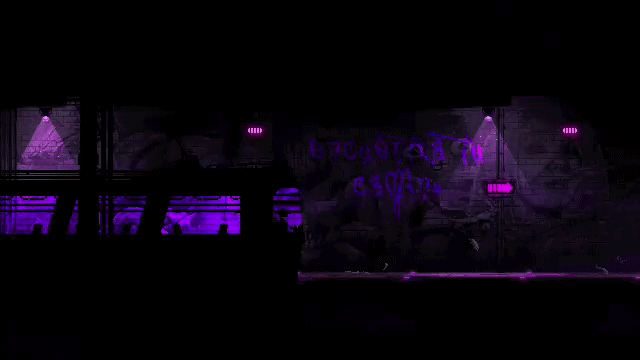
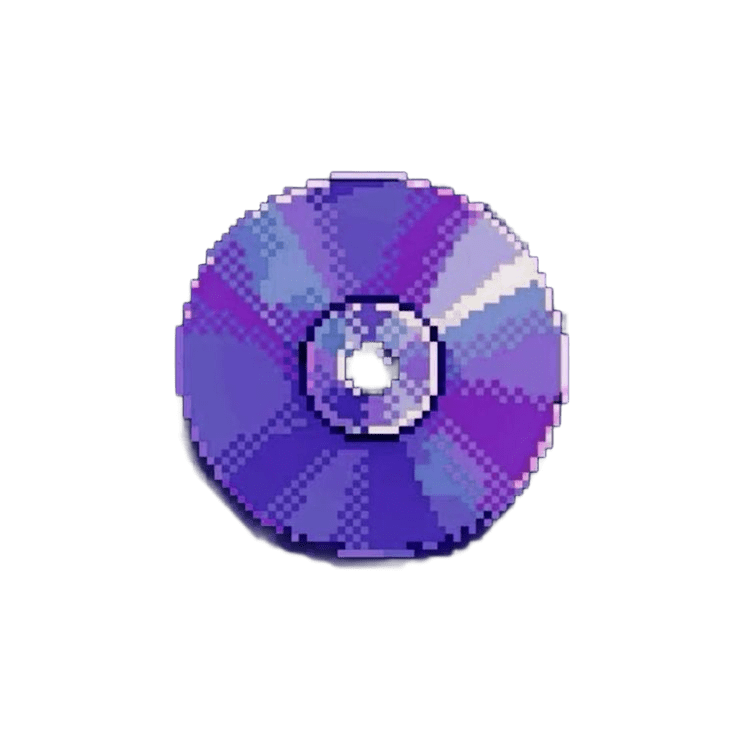
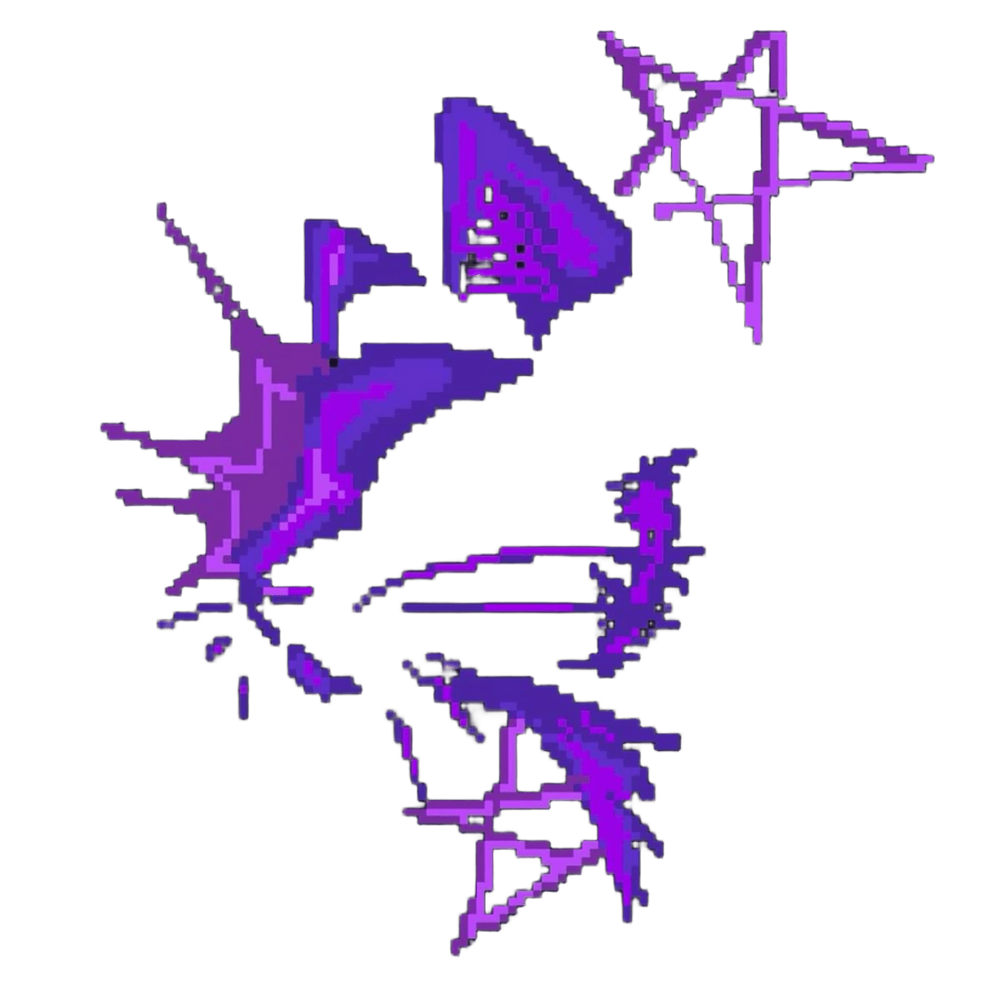

  
  

  

  

<h3>🔗 Connect with me ˎˊ˗</h3>

---

<h2 align="center">౨ৎ About me</h2>

  
  

    
Hello! I'm **Melissa Gonçalves** — a Security Engineering student at **UFABC** with a focus on *cybersecurity, network security, cloud infrastructure, and intelligent systems*.

Currently conducting undergraduate research in ***OpenRAN/5G Security + Machine Learning***, investigating *physical-layer authentication mechanisms* through **Radio Frequency Fingerprinting (RFF)** and **ML-based spoofing detection** in next-generation wireless networks.

My research explores how *raw I/Q signal samples, radio signatures, and machine learning techniques* can be used to improve security in **disaggregated OpenRAN architectures** and **5G environments**.

 

  

  
  

    
<h3>Building toward ˎˊ˗</h3>

 

  

 

 

---

<h2 align="center">౨ৎ Current Stack</h2>

  
       

     

---
<h2 align="center">౨ৎ Profile Metrics</h2>

  
  

&nbsp;&nbsp;

  

---
